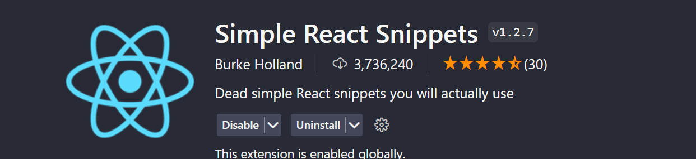
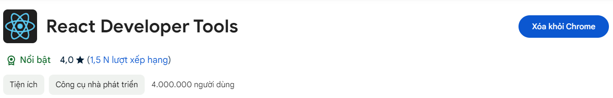
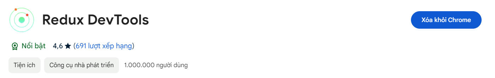

# 🎯 Buổi 1: Nhập môn React, JSX & Component

Chào mừng các bạn đến với buổi học đầu tiên của khóa ReactJS. Trong buổi này, chúng ta sẽ thiết lập môi trường làm việc, tìm hiểu các khái niệm cốt lõi, cú pháp cơ bản và tự tay khởi tạo dự án React đầu tiên.

---

## I. Cài đặt môi trường làm việc

Để code ReactJS trơn tru, các bạn cần cài đặt đầy đủ các công cụ sau:

- [x] **Cài đặt NodeJS và Git SCM**
  - Cài đặt NodeJS (Môi trường chạy JS): [https://nodejs.org/en/download/](https://nodejs.org/en/download/)
  - Cài đặt Git (Quản lý source code): [https://git-scm.com/](https://git-scm.com/)

- [x] **Cài đặt Extension cho VS Code**
  - Cài đặt **Simple React Snippets** (Hỗ trợ gõ code React nhanh).
    

- [x] **Cài đặt Tiện ích mở rộng (Extension) trên Trình duyệt**
  - **React Developer Tools**: Giúp debug và xem cấu trúc Component.
    
  - **Redux DevTools**: Chuẩn bị cho các buổi học quản lý State sau này.
    

---

## II. Lý thuyết nền tảng: ReactJS, SPA/MPA & Virtual DOM

### 1. ReactJS là gì?

- Là một thư viện JavaScript mã nguồn mở được phát triển bởi Facebook (ra mắt năm 2013).
- Dùng để xây dựng Giao diện người dùng (UI) cho Web và Mobile.
- Điểm mạnh: Trải nghiệm người dùng mượt mà, hiệu năng cao nhờ Virtual DOM và khả năng Hot Reload giúp lập trình viên code nhanh hơn.

### 2. So sánh SPA và MPA

_(Tham khảo video: [Youtube Link](https://www.youtube.com/watch?v=30sMCciFIAM))_

- [x] **SPA - Single-Page Application (Ứng dụng trang đơn):**
  - Cách tiếp cận hiện đại (VD: Facebook, Shopee, ZingMP3).
  - Không yêu cầu tải lại toàn bộ trang khi người dùng thao tác.
  - Trải nghiệm cực nhanh vì tài nguyên chỉ tải 1 lần đầu tiên, sau đó chỉ tải thêm dữ liệu cần thiết.
  - _Nhược điểm:_ Lần tải đầu tiên có thể chậm nếu không tối ưu tốt, khó SEO hơn web truyền thống.

- [x] **MPA - Multi-Page Application (Ứng dụng nhiều trang):**
  - Cách tiếp cận cổ điển (VD: Các trang báo mạng, tin tức).
  - Trình duyệt phải tải lại toàn bộ trang mỗi khi click chuyển hướng.
  - Chậm hơn về mặt trải nghiệm nhưng cực kỳ thân thiện với SEO.

### 3. Virtual DOM (DOM Ảo)

- **DOM thật (Real DOM):** Đại diện cho cấu trúc giao diện của trang web. Việc cập nhật trực tiếp Real DOM thường rất chậm và tốn kém tài nguyên máy tính.
- **Virtual DOM:** Là một bản sao nhẹ của Real DOM được React lưu giữ trong bộ nhớ.
- **Cơ chế hoạt động:** Khi có sự thay đổi dữ liệu, React sẽ tạo ra một Virtual DOM mới. Sau đó, nó sẽ so sánh (Diffing) Virtual DOM mới này với Virtual DOM cũ để tìm ra **chính xác** những phần tử bị thay đổi. Cuối cùng, React chỉ cập nhật đúng những phần tử đó lên Real DOM, giúp tối ưu hóa hiệu năng ứng dụng một cách tối đa.

---

## III. Khởi tạo dự án & Tư duy Component

### 1. Khởi tạo dự án

_(Tham khảo: [React Docs](https://create-react-app.dev/docs/getting-started/))_

Bạn có thể dùng Create-React-App (CRA) hoặc Vite. Khuyến khích sử dụng **Vite** cho các dự án mới vì tốc độ khởi tạo và build cực kỳ nhanh.

- **Sử dụng Vite (Khuyên dùng):**
  ```sh
  npm create vite@latest my-app -- --template react
  cd my-app
  npm install
  npm run dev
  ```

### 2. Cú pháp JSX (JavaScript XML)

JSX là một cú pháp mở rộng của JavaScript, cho phép chúng ta viết mã HTML trực tiếp bên trong JavaScript. Nó giúp code trực quan và dễ xây dựng UI hơn.

- **Một số quy tắc bắt buộc của JSX:**
  1. **Chỉ trả về 1 phần tử gốc:** Bạn phải bọc toàn bộ mã JSX trong một thẻ cha duy nhất (như `<div></div>` hoặc Fragment `<></>`).
  2. **Mọi thẻ đều phải đóng:** Các thẻ tự đóng trong HTML phải có dấu gạch chéo (VD: ``, `<input />`, `<br />`).
  3. **Quy tắc CamelCase:** Các thuộc tính HTML phải được viết theo kiểu camelCase (VD: dùng `className` thay cho `class`, `onClick` thay cho `onclick`).
  4. **Nhúng JavaScript:** Sử dụng cặp ngoặc nhọn `{}` để chèn các biến hoặc biểu thức JavaScript vào trong JSX.

### 3. Functional Components

- **Component là gì?** Giao diện React được chia nhỏ thành các khối độc lập, có thể tái sử dụng gọi là Component.
- **Functional Component:** Là cách viết component phổ biến và hiện đại nhất trong React. Về cơ bản, nó chỉ là một hàm JavaScript bình thường trả về một khối JSX.

- **Ví dụ cơ bản:**

```jsx
import React from "react";

// Tạo một Functional Component bằng Arrow Function
const Welcome = () => {
  const courseName = "ReactJS HIT 2026"; // Biến JS

  return (
    <div className="welcome-box">
      {/* Sử dụng {} để gọi biến courseName */}
      <h1>Chào mừng bạn đến với khóa học {courseName}</h1>
      <p>Hôm nay chúng ta đã học về JSX và Functional Components.</p>
    </div>
  );
};

export default Welcome; // Export để dùng ở file khác
```
