# REDUX CORE

## 1. Why
**Vấn đề:** Tưởng tượng bạn đang viết một ứng dụng quản lý phim có tính năng đăng nhập và xem danh sách các phim. Các component được tổ chức như sau:

- `MoviesList`: Hiển thị danh sách các phim, bao gồm 1 list các component `Movie`
- `Movie`: là 1 item trong `MoviesList`, hiển thị thông tin một phim
- `Login`: chức năng đăng nhập

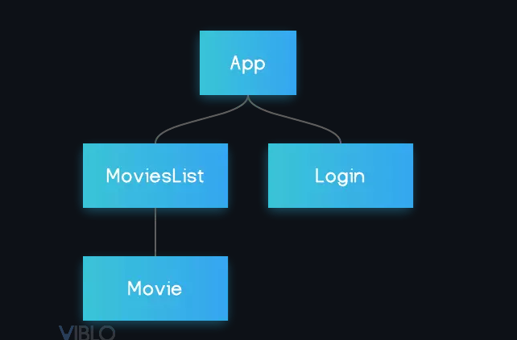

Ta có data là danh sách thông tin các phim, khi đó data được chuyển đổi qua lại giữa các component trong ứng dụng như thế nào? Theo kiến thức cơ bản đã được học, ta có thể để data là state trong `MoviesList`, rồi truyền data xuống component `Movie` dưới dạng props.

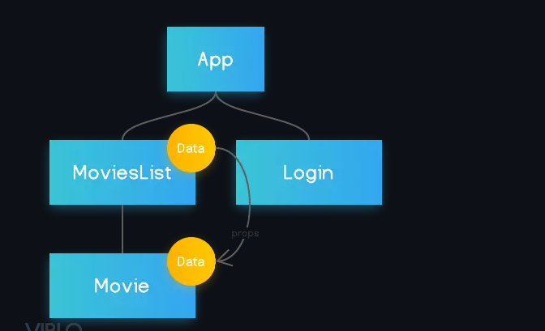

Cách này ổn cho đến khi ta thêm 1 component mới, ví dụ như `Search`, để search các phim, và nó cũng sử dụng data. Vì là 1 component riêng, ta không thể truyền data từ component `MovieList` sang bằng props được.

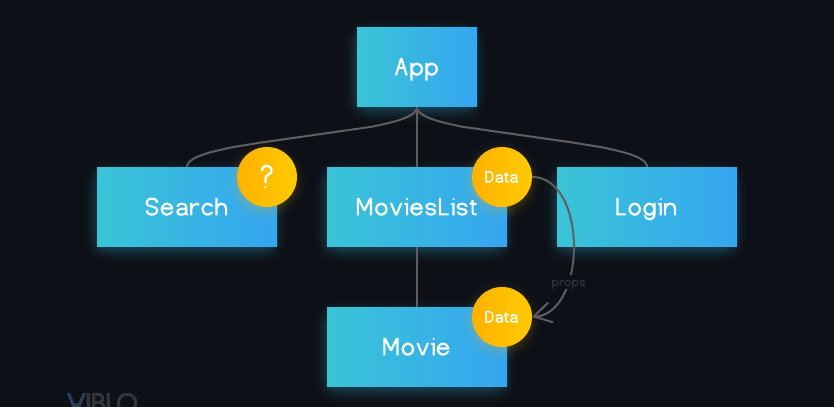

Lúc này ta buộc phải đưa data lên component ở trên nữa là `App` mới có thể truyền data xuống `Search` component. Dễ thấy theo mô hình này, khi ứng dụng mở rộng thêm các loại data khác, tất cả sẽ được đưa vào `App` và các hàm xử lý data cũng phải định nghĩa ở `App`, khiến `App` component trở nên khổng lồ với vô vàn trách nhiệm. Bad design!

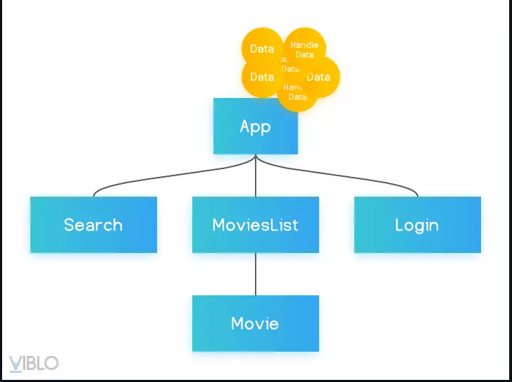

**Giải pháp:** Với Redux, ta đưa tất cả data, các state vào 1 nơi gọi là **store**, khi component nào cần dùng hoặc thay đổi data, nó sẽ lấy hoặc cập nhật data ở store. Các data trong các component là thống nhất với nhau vì store là toàn cục trong toàn bộ App.

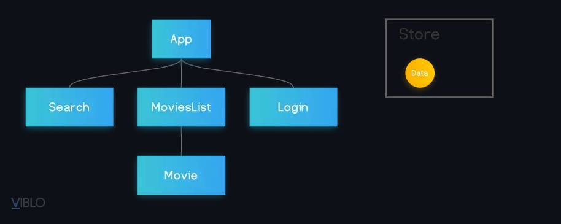

## 2. What
- Redux là một pattern (khuôn mẫu).
- Là một thư viện JS dùng để quản lý và cập nhập state của ứng dụng.

## 3. When
Redux sẽ rất hữu dụng đối với các trường hợp sau đây:
- Dự án có số lượng lớn state và các state được sử dụng ở nhiều nơi.
- State được cập nhập thường xuyên.
- Logic code cập nhập state phức tạp.
- Ứng dụng có số lượng code trung bình hoặc lớn và có nhiều người làm chung.
- Cần debug và muốn xem cách state được cập nhật tại bất kỳ khoảng thời gian nào.

## 4. How
Cơ chế hoạt động của nó được tóm gọn trong 1 sơ đồ đơn giản:

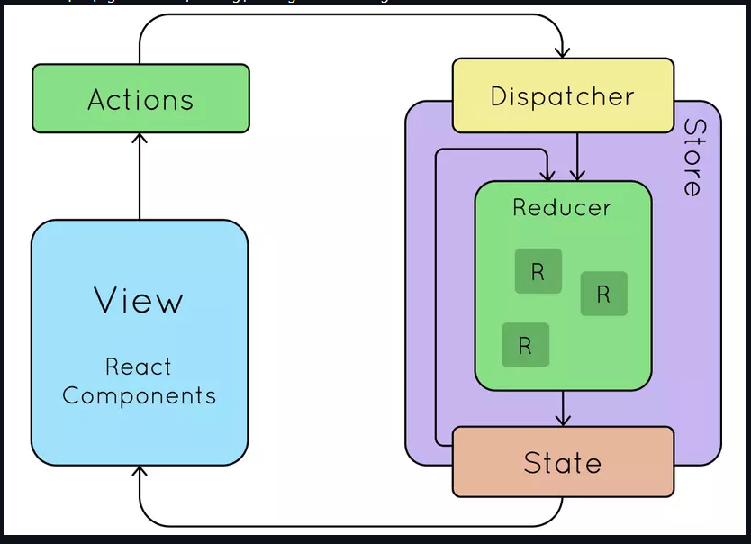

Các thành phần của Redux bao gồm:
- **Store**: Store đơn giản là 1 object chứa tất cả state toàn cục của ứng dụng. Nhưng thay vì lưu các state, nó lưu các reducer.
- **Các Action**: Khi ta định nghĩa các action, ta khai báo các tên của hành động trong ứng dụng. Lấy ví dụ ta có 1 state là `counter` và cần 2 phương thức để tăng và giảm giá trị của `counter`. Lúc này ta định nghĩa 2 action có tên là 'INCREMENT' và 'DECREMENT' và chỉ vậy thôi, việc xử lý thay đổi state của `counter` sẽ nhường cho reducer.
- **Các Reducer**: 1 reducer tương đương với 1 state nhưng kèm theo các mô tả state sẽ thay đổi như thế nào khi các action khác nhau được gọi. Trong ví dụ ta có reducer là `counter`, nó lưu state của `counter` và kiểm tra action vừa được gọi là INCREMENT hay DECREMENT và trả về state mới là state+1 hay state-1 tương ứng.
- **Các Dispatch**: Khi cần dùng 1 action ở component, ta gọi action đó đơn giản bằng cách sử dụng phương thức `dispatch`. VD: `dispatch(increment())`, `dispatch(decrement())`.

**Các bước dùng redux truyền thống:**
**B1: Cài đặt**
```bash
# NPM
npm install redux react-redux

# Yarn
yarn add redux react-redux
```

**B2: Tạo một thư mục store và các file liên quan**

- File `type.js`

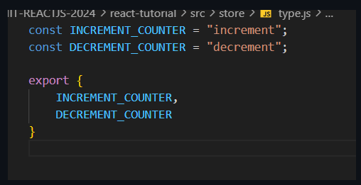

- File `action.js`

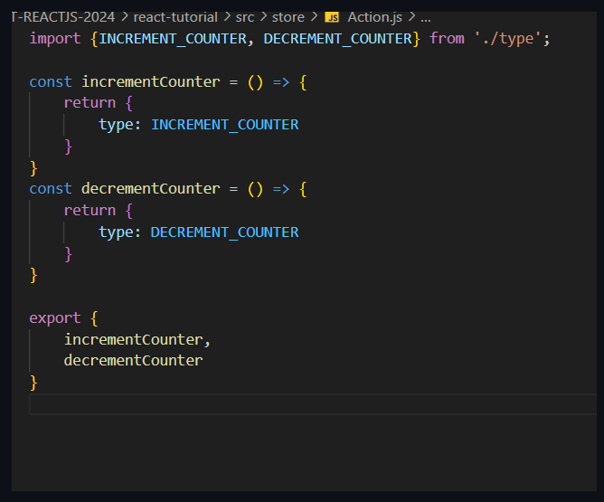

- File `reducer.js`

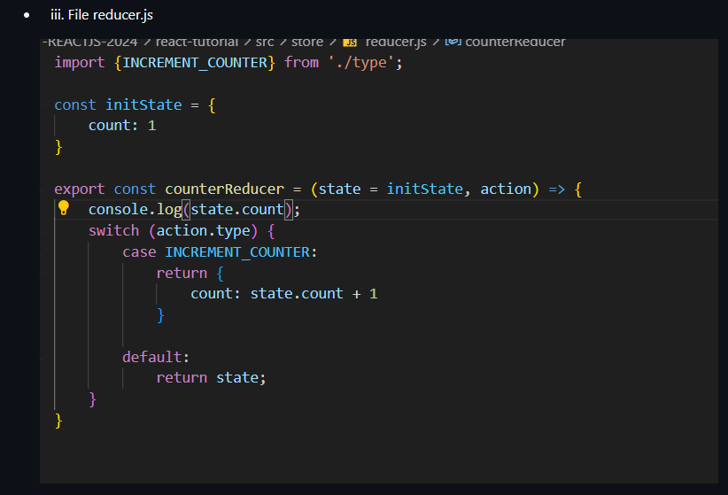

- File `index.js`

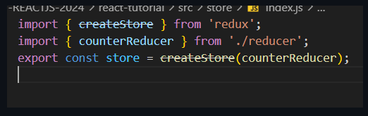

**B3: Fix file main**

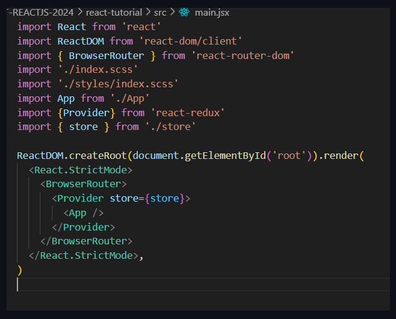


**B4: Fix file App**

Trong component `App`, chúng ta sẽ sử dụng hook `useSelector` để lấy state từ store và `useDispatch` để gửi action đi.

```jsx
import React from 'react';
import { useSelector, useDispatch } from 'react-redux';
import { incrementCounter, decrementCounter } from './store/action';

function App() {
  // Lấy giá trị count từ Redux Store
  const count = useSelector(state => state.count);
  
  // Khởi tạo dispatch để gửi action
  const dispatch = useDispatch();

  return (
    <div style={{ textAlign: 'center', marginTop: '50px' }}>
      <h1>Redux Core Counter</h1>
      <h2>Giá trị hiện tại: {count}</h2>
      
      <button onClick={() => dispatch(incrementCounter())} style={{ margin: '10px' }}>
        Tăng (Increment)
      </button>
      <button onClick={() => dispatch(decrementCounter())} style={{ margin: '10px' }}>
        Giảm (Decrement)
      </button>
    </div>
  );
}

export default App;
```

---

# Lý thuyết Redux Toolkit (RTK) - Redux Hiện đại
## 🎯 Tổng quan

Redux Toolkit (RTK) là bộ công cụ chính thức để viết logic Redux một cách hiệu quả. RTK được thiết kế để giải quyết các vấn đề phổ biến của Redux truyền thống:

- Quá nhiều boilerplate code (code lặp đi lặp lại)
- Cấu hình store phức tạp
- Cần cài đặt nhiều thư viện (packages) bổ sung
- Cập nhật state bất biến (immutable updates) khó viết

## 📦 Cài đặt Thư viện (Installation)

Để bắt đầu sử dụng Redux Toolkit trong dự án React, bạn cần cài đặt 2 thư viện chính:

- `@reduxjs/toolkit`: Chứa phần lõi của RTK (configureStore, createSlice, thunk,...).
- `react-redux`: Thư viện cung cấp các hooks (`useSelector`, `useDispatch`) giúp kết nối Redux store với React components.

Sử dụng công cụ quản lý package tương ứng của dự án (NPM, Yarn hoặc pnpm) để cài đặt:

**Sử dụng NPM:**

```bash
npm install @reduxjs/toolkit react-redux
```

## 🔄 Sơ đồ Luồng Redux (Redux Flow Diagram)

```text
┌─────────────┐    dispatch(action)   ┌─────────────┐
│   UI/View   │ ────────────────────► │   Action    │
│ (Component) │                       │ (createSlice)│
└─────────────┘                       └─────────────┘
       ▲                                      │
       │ useSelector                          ▼
       │                            ┌─────────────┐
       │                            │   Reducer   │
       │                            │ (createSlice)│
       │                            └─────────────┘
       │                                      │
       │                                      ▼
┌─────────────┐                       ┌─────────────┐
│   Store     │ ◄──────────────────── │    State    │
│(configureStore)│                    │ (Đã cập nhật)│
└─────────────┘                       └─────────────┘
```

## 🆚 RTK vs Redux Truyền thống

| Tiêu chí                         | Redux Truyền thống             | Redux Toolkit                         |
| :------------------------------- | :----------------------------- | :------------------------------------ |
| **Code lặp lại (Boilerplate)**   | Nhiều code lặp lại             | Tối thiểu code lặp lại                |
| **Cài đặt Store**                | Phức tạp, nhiều cấu hình       | `configureStore()` đơn giản           |
| **Reducers**                     | Viết tay, dễ xảy ra lỗi        | `createSlice()` tự động tạo           |
| **Tính bất biến (Immutability)** | Dùng spread operators phức tạp | Tích hợp sẵn Immer, viết code dễ dàng |
| **DevTools**                     | Cần cấu hình thêm              | Tự động kích hoạt                     |
| **Logic Bất đồng bộ (Async)**    | Cần cài riêng Redux-thunk/saga | Tích hợp sẵn `createAsyncThunk`       |

## 🏗️ Các Khái niệm Cốt lõi (Core Concepts)

### 1. `configureStore()`

- Thay thế cho `createStore()`.
- Tự động cài đặt middleware.
- Tích hợp sẵn Redux DevTools.

_(`src/App/Store.jsx`)_

```javascript
import { configureStore } from "@reduxjs/toolkit";
import shopReducer from "../features/shop/shopSlice";

// Khởi tạo store tập trung
export const Store = configureStore({
  reducer: {
    shop: shopReducer,
  },
});
```

### 2. `createSlice()`

- Tạo reducer và actions cùng một lúc.
- Tích hợp thư viện Immer hỗ trợ cập nhật state bất biến một cách an toàn mà không cần dùng spread operator (`...`).
- Tự động tạo action creators.

_(`src/features/shop/shopSlice.jsx`)_

```javascript
import { createSlice } from "@reduxjs/toolkit";

const shopSlice = createSlice({
  name: "shop",
  initialState: {
    products: [], // Danh sách sản phẩm từ API
    cart: [], // Giỏ hàng của user
    status: "idle", // 'idle' | 'loading' | 'succeeded' | 'failed'
    error: null,
  },
  // REDUCERS ĐỒNG BỘ: Thêm/Xóa khỏi giỏ hàng
  reducers: {
    addToCart: (state, action) => {
      // payload là toàn bộ object sản phẩm
      const product = action.payload;
      const existingItem = state.cart.find((item) => item.id === product.id);

      if (existingItem) {
        // 💡 Nhờ có Immer, ta có thể viết code trực tiếp thay đổi state (mutate)
        existingItem.quantity += 1;
      } else {
        state.cart.push({ ...product, quantity: 1 });
      }
    },
    removeFromCart: (state, action) => {
      // payload là ID của sản phẩm cần xóa
      state.cart = state.cart.filter((item) => item.id !== action.payload);
    },
  },
});

// Tự động export các actions để dùng trong component
export const { addToCart, removeFromCart } = shopSlice.actions;

// Export reducer để gắn vào configureStore
export default shopSlice.reducer;
```

### 3. `createAsyncThunk()`

- Xử lý các tác vụ bất đồng bộ (ví dụ: gọi API).
- Tự động tạo các actions theo vòng đời: `pending` (đang chờ), `fulfilled` (thành công), `rejected` (thất bại).

_(`src/features/shop/shopSlice.jsx`)_

```javascript
import { createSlice, createAsyncThunk } from "@reduxjs/toolkit";

// ASYNC THUNK: Gọi API lấy danh sách sản phẩm
export const fetchProducts = createAsyncThunk(
  "shop/fetchProducts",
  async () => {
    // Sử dụng FakeStoreAPI để lấy dữ liệu mẫu
    const response = await fetch("https://fakestoreapi.com/products?limit=4");
    return await response.json();
  },
);

const shopSlice = createSlice({
  name: "shop",
  initialState: { products: [], cart: [], status: "idle", error: null },
  reducers: {
    /* ... addToCart, removeFromCart ... */
  },
  // EXTRA REDUCERS: Xử lý trạng thái của Async Thunk
  extraReducers: (builder) => {
    builder
      .addCase(fetchProducts.pending, (state) => {
        state.status = "loading"; // API đang gọi
      })
      .addCase(fetchProducts.fulfilled, (state, action) => {
        state.status = "succeeded"; // API gọi thành công
        state.products = action.payload; // Lưu dữ liệu trả về
      })
      .addCase(fetchProducts.rejected, (state, action) => {
        state.status = "failed"; // API lỗi
        state.error = action.error.message;
      });
  },
});

export default shopSlice.reducer;
```

### 4. Sử dụng Store trong Component (với `useSelector` và `useDispatch`)

_(`src/App.jsx`)_

```javascript
import { useEffect } from "react";
import { useSelector, useDispatch } from "react-redux";
import { fetchProducts, addToCart, removeFromCart } from "./features/shop/shopSlice";

function App() {
  const dispatch = useDispatch();

  // Trích xuất state từ Redux store
  const { products, cart, status } = useSelector((state) => state.shop);

  // Gọi API (Async Thunk) khi load component
  useEffect(() => {
    if (status === "idle") {
      dispatch(fetchProducts());
    }
  }, [status, dispatch]);

  return (
      // ... render UI ...
      <button onClick={() => dispatch(addToCart(product))}>Thêm vào giỏ</button>
      <button onClick={() => dispatch(removeFromCart(item.id))}>Xóa</button>
  );
}
```

### 5. RTK Query (Kiến thức mở rộng)

_Giải pháp mạnh mẽ để Fetch data (lấy dữ liệu) và caching. Hiện tại dự án của bạn đang dùng `createAsyncThunk`, nhưng nếu chuyển sang dùng RTK Query cho hệ thống Shop thì code sẽ trông như sau:_

```javascript
import { createApi, fetchBaseQuery } from "@reduxjs/toolkit/query/react";

// Khởi tạo một service RTK Query để lấy sản phẩm
export const shopApi = createApi({
  reducerPath: "shopApi",
  baseQuery: fetchBaseQuery({ baseUrl: "https://fakestoreapi.com/" }),
  endpoints: (builder) => ({
    getProducts: builder.query({
      query: (limit = 4) => `products?limit=${limit}`,
    }),
  }),
});

// RTK Query tự động generate một Hook dựa trên tên endpoint
export const { useGetProductsQuery } = shopApi;
```

## 📊 Thực hành Tốt nhất cho Cấu trúc State (State Structure Best Practices)

```javascript
// ✅ Tốt: Cấu trúc state được chia nhỏ khoa học (Như trong dự án của bạn)
{
  shop: {
    products: [
      { id: 1, title: "Fjallraven - Foldsack", price: 109.95 }
    ],
    cart: [
      { id: 1, title: "Fjallraven - Foldsack", price: 109.95, quantity: 2 }
    ],
    status: "succeeded",
    error: null
  }
}

// ❌ Chưa tốt: Cấu trúc lồng ghép, chưa chuẩn hóa (Nested, denormalized structure)
{
  shop: {
    data: {
      usersCart: [
        { id: 1, title: "Fjallraven - Foldsack", productDetails: { price: 109.95 } }
      ]
    }
  }
}
```

## 🤔 Khi nào nên sử dụng RTK?

**✅ Nên sử dụng khi:**

- Ứng dụng có state phức tạp (như giỏ hàng, thông tin user), nhiều components cần chia sẻ state chung.
- Cần luồng cập nhật state dễ dự đoán (predictable).
- Team lớn, dự án cần tính nhất quán cao.
- Phải xử lý nhiều tác vụ bất đồng bộ (async operations như gọi API).

**❌ Không cần thiết khi:**

- Ứng dụng quá đơn giản, dữ liệu chỉ cần quản lý nội bộ trong từng component bằng `useState`.
- Cần làm bản nguyên mẫu (prototype) nhanh chóng.

## 🔧 Lưu ý về Hiệu suất (Performance Considerations)

**Các kỹ thuật tối ưu hóa:**

- **Selector Memoization:** Sử dụng `useSelector` kết hợp với thư viện `reselect` để tránh render lại không cần thiết.
- **Component Memoization:** Bọc các components bằng `React.memo`.
- **State Normalization:** Giữ cấu trúc state phẳng (flat structure) thay vì lồng ghép quá sâu.
- **Selective Subscriptions:** Components chỉ nên dùng `useSelector` để lấy những state mà chúng thực sự cần (như việc tách riêng `products` và `cart` thay vì gọi chung `state.shop`).
